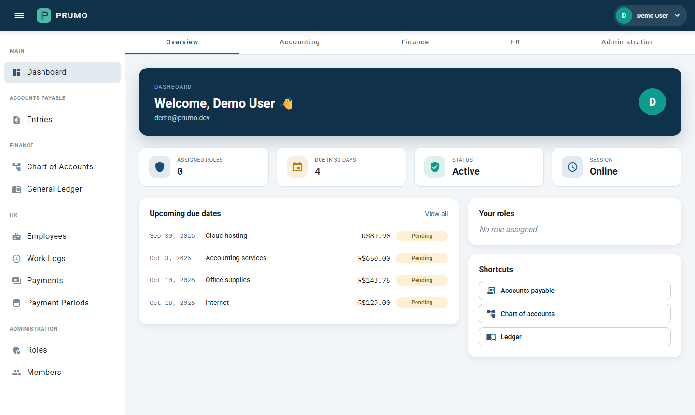
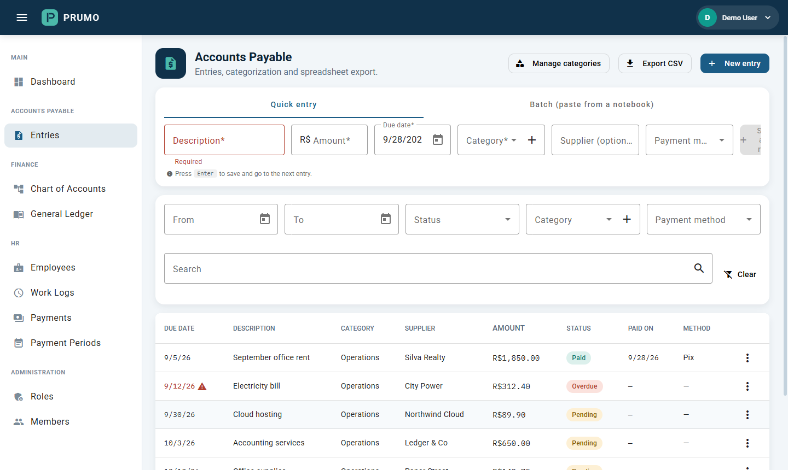
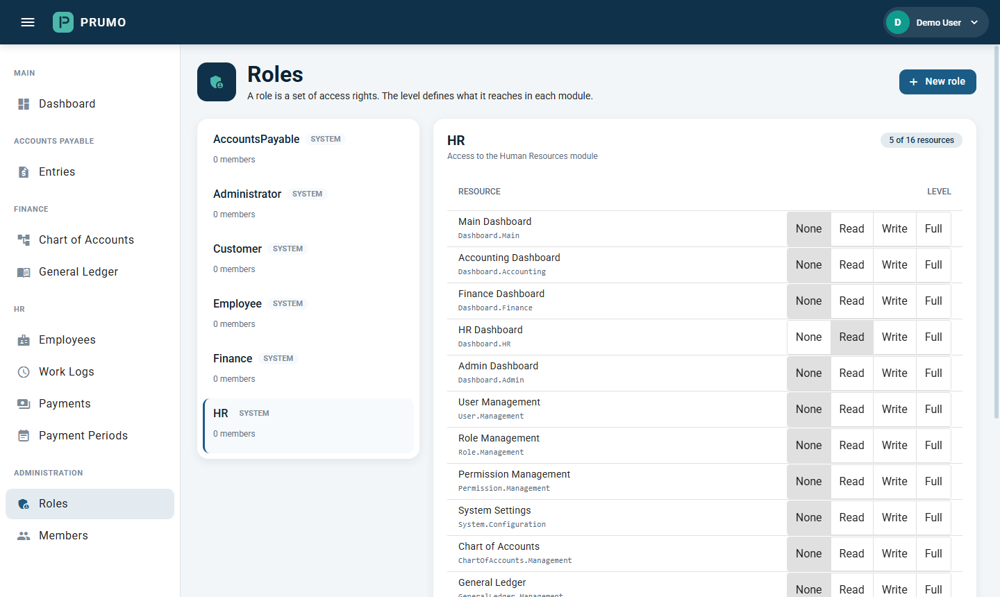
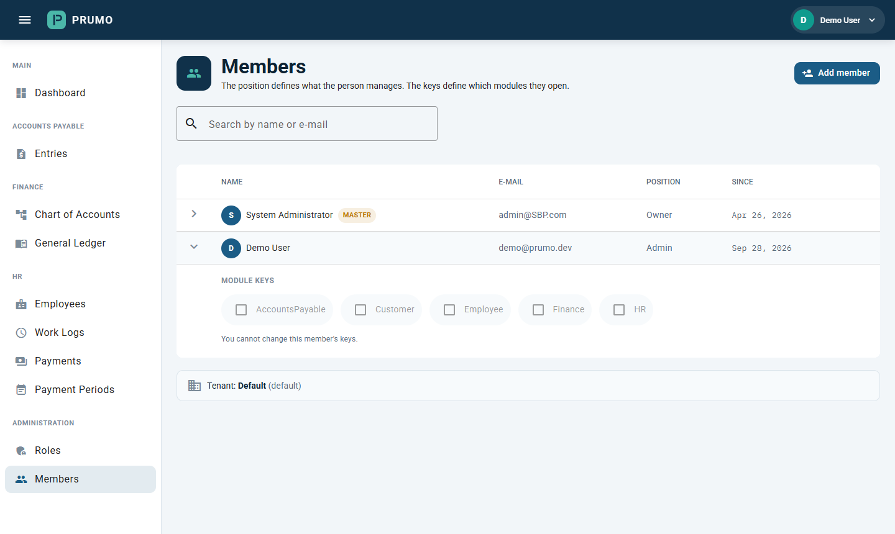
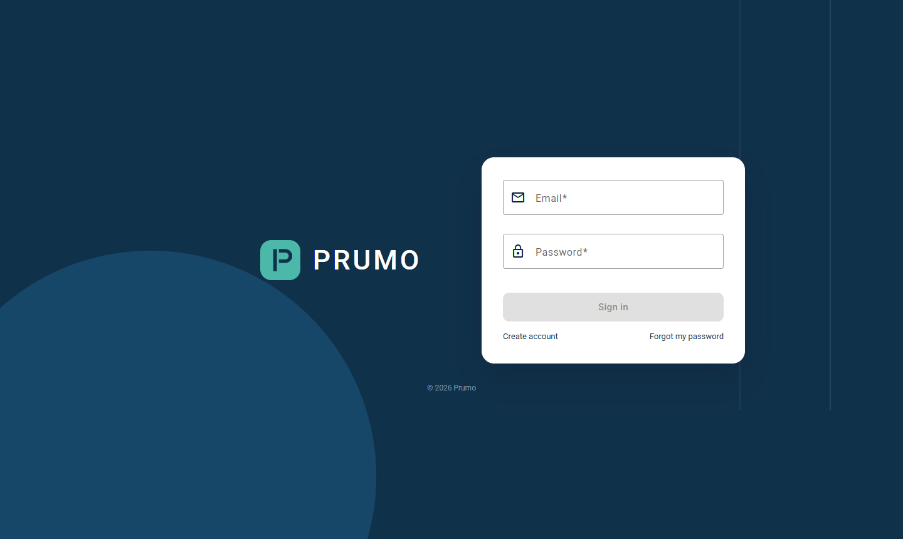

# Prumo — Frontend

[](https://github.com/nickolascheidt/Prumo-Angular/actions/workflows/ci.yml)

*[Leia em português](README.pt-BR.md)*

The Angular 18 SPA for Prumo, a multi-tenant ERP: accounts payable, a small financial
core (chart of accounts and general ledger), HR (employees, work logs, payments) and
per-tenant access control.

This is a portfolio project, not running in production. The API, where the tenant
isolation and access control live, is [Prumo](https://github.com/nickolascheidt/Prumo);
the deployment design is [Prumo-DevOps](https://github.com/nickolascheidt/Prumo-DevOps).



| | |
|---|---|
|  |  |
| Accounts payable: quick entry, batch paste, filters and CSV export | Roles: what each role reaches, per resource, from None to Full |
|  |  |
| Members: administrative position and module keys, per tenant | Sign in, sign-up with e-mail confirmation, password reset |

## What the frontend does

- **Menus and routes follow the API's access model.** After sign-in the SPA loads the
  user's level on every resource of the selected tenant (`GET /api/resources/my-permissions`).
  The sidenav hides what the user cannot reach, and `resourceAccessGuard` blocks the route
  with the level the screen needs (`Read` to open it, `Write` for the create/edit forms).
  The API enforces the same rules on its own; the SPA only avoids offering what would
  be refused.
- **Roles and members are managed per tenant.** Owners and admins create roles, set their
  level on each resource, and hand out "module keys" to members. People are added by
  e-mail: an existing account joins right away, otherwise an invitation waits for sign-up.
- **The account lifecycle has its own screens**: sign-up, check your e-mail, confirm,
  forgot and reset password, and a waiting screen for accounts that belong to no company
  yet.
- **Enum values arrive as strings.** The API serializes `TenantRole` and `PermissionLevel`
  as `"Owner"` and `"Read"`; `toTenantRole` and `toPermissionLevel` in `core/models`
  normalize them at the boundary, and specs cover it.
- **Calendar days stay calendar days.** Due dates, work dates and pay periods are
  displayed in UTC and sent back as `YYYY-MM-DD` (`core/utils/date-only.ts`), so they do
  not shift a day in time zones west of Greenwich.

## Tech stack

| | |
|---|---|
| Framework | Angular 18, standalone components |
| UI | Angular Material 18 with a custom M2 theme |
| Language | TypeScript 5.5, strict mode |
| State | RxJS `BehaviorSubject`s in services (no NgRx) |
| HTTP | `HttpClient` + a JWT interceptor |
| Tests | Karma + Jasmine |

## Running it locally

You need Node.js 20+ and the [API](https://github.com/nickolascheidt/Prumo) running on
`http://localhost:5201`.

```bash
npm install
npm start          # http://localhost:4200
```

```bash
npm run build      # development build
npm run build:prod # production build
npm test           # unit tests (Karma)
npx ng test --watch=false --browsers=ChromeHeadless   # what CI runs
```

The API seeds a master admin (`admin@SBP.com`, password from the API's user secrets).
To see the app as a regular tenant member, sign up with any e-mail: the confirmation
link is written to the API log in Development.

## Project structure

```
src/app/
├── app.routes.ts      routes, guards per route, tenant selection guard
├── core/
│   ├── guards/        authGuard, resourceAccessGuard
│   ├── interceptors/  JWT interceptor
│   ├── models/        interfaces, enums and the string → enum normalizers
│   ├── services/      ApiService (every HTTP call), AuthService, PermissionService
│   └── utils/         date-only helpers
├── modules/
│   ├── auth/              sign in, sign-up, e-mail confirmation, password reset, tenant selection
│   ├── dashboard/         overview plus accounting, finance, HR and admin tabs
│   ├── accounts-payable/  list, form, quick entry, categories
│   ├── finance/           chart of accounts, general ledger
│   ├── hr/                employees, work logs, payments, payment periods
│   └── admin/             roles and level grid, members and invitations
└── shared/components/  layout (toolbar + sidenav), brand mark
```

## Routes

| Route | Resource | Level |
|---|---|---|
| `/auth/*` | — | public |
| `/dashboard/overview` | — | any member |
| `/dashboard/accounting`, `/finance`, `/hr`, `/admin` | `Dashboard.*` | Read |
| `/accounts-payable` | `AccountsPayable.Entries` | Read (Write for new/edit) |
| `/finance/chart-of-accounts` | `ChartOfAccounts.Management` | Read |
| `/finance/general-ledger` | `GeneralLedger.Management` | Read |
| `/hr/employees`, `/worklogs`, `/payments`, `/payment-periods` | `HR.*` | Read |
| `/admin/roles` | `Role.Management` | Read |
| `/admin/members` | `User.Management` | Read |

## Deployment

The `Dockerfile` builds the app and serves it from nginx on port 8080. `/api/` is
proxied to the API through `nginx/default.conf.template`, configured by the `API_URL`
(origin) and `API_HOST` (host header) environment variables. The container and the rest
of the stack are described in [Prumo-DevOps](https://github.com/nickolascheidt/Prumo-DevOps).

## License

[MIT](LICENSE)
